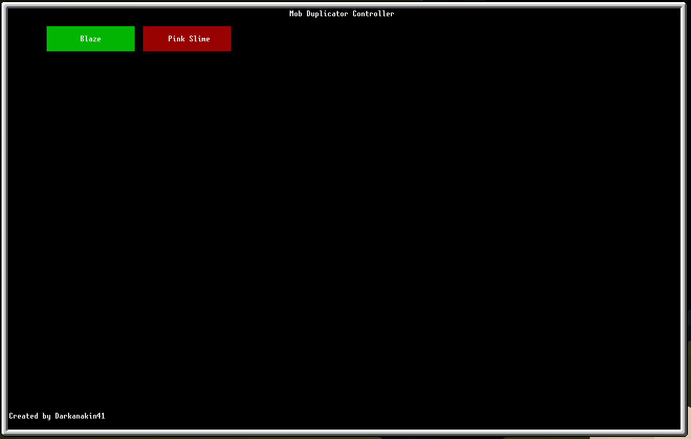

RedStone Spawner Controller
===

This is a little lua programme I wrote for Modded Minecraft 1.12 with [OpenComputers](https://www.curseforge.com/minecraft/mc-mods/opencomputers)
and [Industrial Foregoing](https://www.curseforge.com/minecraft/mc-mods/industrial-foregoing).

This code is far from perfect as it is my first try with lua language, but I am pretty happy with the result overall.



Installation
---

You need to have a OpenComputers computer with one or more RedStone interface linked to your spawners.

Then, you need to download all the three following files : 
* [buttonAPI](./buttonAPI.lua) (I cannot find the PasteBin I have downloaded it from)
* [controller](./controller.lua)
* [settings](./settings.lua)

Configuration
--- 

The settings.lua contains Configuration for your different spawners.

Configuration look something like this : 
```lua
local spawners = {
  {
    name = "Blaze", -- The name of the spawner, which is displayed in buttons
    controller = 1, -- The number of the controller
    side = sides.north, -- The side to output redstone to
    state = 0, - The initial state of the redstone link: 255 is ON, anything else is OFF (better put 0 for OFF)
  },
}
```

You will need to duplicate the object as many time as you have Mob Spawner.

Execution 
---

Once you installed and configured the code, you can run `controller` and it will launch the interface :


TODO
---
* [ ] Find a solution to read the Spawner content instead of configuring it via a file
* [ ] Find a better solution for RedStone interfaces
* [ ] Make it work with bundled cables ( EnderIO RedStone Conduits colors is not supported by OpenComputer :( )